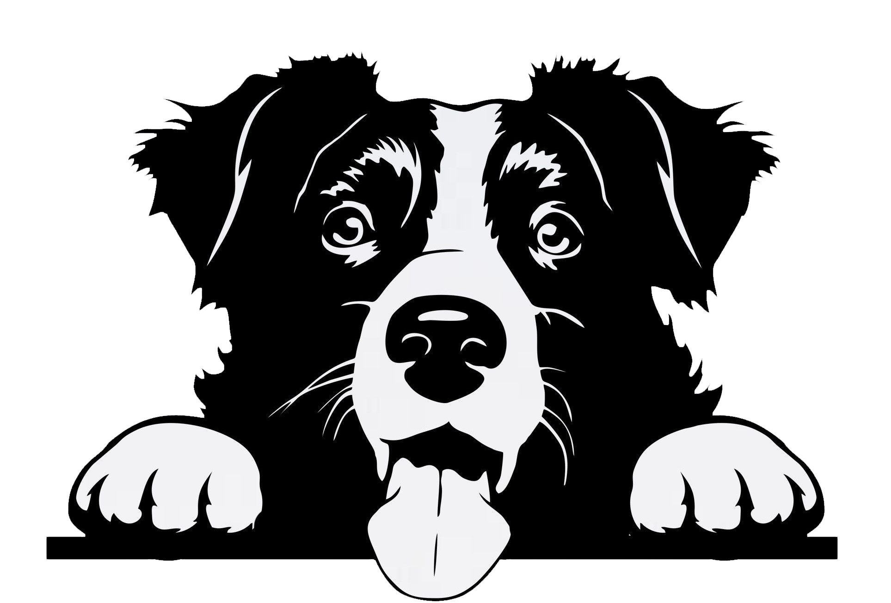

# Dog Breed Image Dataset Classification With Tensorflow and Python

 ## 📋 Project Abstract
This project aims to create a convolutional neural network for a novel six-class dog image dataset using Tensorflow. 

For this project, I have implemented a VGG8 CNN architecture, a deep learning model designed for processing grid-like data (in this case images of dogs) for classification. 

As the name suggests, it utilizes 8 layers with learnable parameters.

## 🧮 Model

VGG8 is, in essence, a smaller version of the original VGG16 and VGG19 architectures introduced by the Visual Geometry Group at the University of Oxford:

> Simonyan, K., & Zisserman, A. (2014). Very deep convolutional networks for large-scale image recognition. arXiv preprint arXiv:1409.1556. https://arxiv.org/abs/1409.1556 

 ## 🐕‍🦺 Dataset

The dataset in use here is the Kaggle dog breed image dataset (Khushi Khushi. (2023). Dog Breed Image Dataset. Kaggle. Retrieved from https://www.kaggle.com/datasets/khushikhushikhushi/dog-breed-image-dataset) consisting of 10 classes of dog image:

Knowing what each dog class represents is essential to better understand the results. For this project, the classes are:

> #### Golden Retriever
> #### German Shepherd
> #### Labrador Retriever
> #### Bulldog
> #### Beagle
> #### Poodle
> #### Rottweiler
> #### Yorkshire Terrier
> #### Boxer
> #### Dachshund

 ## 🖥️ Usage

Included in the project submission are 4 datasets that are used for testing and training:

> bird6_64_xtest.npy
> 
> bird6_64_xtrain.npy
> 
> bird6_ytest.npy
> 
> bird6_ytrain.npy

As well as the classifier file, which includes extensive commenting to explain relevant code:

> #### Dog_Breed_Dataset_Classifier.py

#### To run:
Use the following command from the command line for the best experience (running on Windows has given some trouble in the past; I recommend a Linux machine or Ubuntu VM):

> #### python3 Classifiers.py 16 32 tmp

Executing the command line command will bring up a summary of the model with the following characteristics:

> #### Total params: 38,930,502 (148.51 MB)
> #### Trainable params: 38,920,518 (148.47 MB)
> #### Non-trainable params: 9,984 (39.00 KB)

Then, the model will be immediately trained for 32 epochs. The output should look something like this:

|    |    |    |    |    |    |    |    |    |    |       |
|----|----|----|----|----|----|----|----|----|----|-------- 
|  0 |  0 |  0 |  0 |  0 |  0 | 19 |  0 |  0 |  1 | Beagle 
|  0 |  0 |  0 |  0 |  0 |  0 | 19 |  0 |  0 |  0 | Boxer  |
|  0 |  0 |  0 |  0 |  0 |  0 | 20 |  0 |  0 |  0 | Bulldog|
|  0 |  0 |  0 |  0 |  0 |  0 | 19 |  0 |  0 |  0 | Dashsund|
|  0 |  0 |  0 |  0 |  0 |  0 | 12 |  0 |  0 |  0 | German_Shepard|
|  0 |  0 |  0 |  0 |  0 |  0 | 18 |  0 |  0 |  0 | Golden_Retriever|
|  0 |  0 |  0 |  0 |  0 |  0 | 17 |  0 |  0 |  0 | Labrador_Retriever|
|  0 |  0 |  0 |  0 |  0 |  0 | 24 |  0 |  0 |  2 | Poodle|
|  0 |  0 |  0 |  0 |  0 |  0 | 22 |  0 |  0 |  0 | Rottweiler|
|  0 |  0 |  0 |  0 |  0 |  0 | 19 |  0 |  0 |  2 | Yorkshire_Terrier|

Test set accuracy: 0.4141, MCC: 0.2903 

Test Set Accuracy is the percentage of correct predictions, and MCC is the Matthews Correlation Coefficient, which indicates a weak positive correlation between true labels and predicted labels. Interpreting the confusion matrix is as follows:

#### Rows represent actual (true) classes:
Each row corresponds to the instances of a specific class in the test set.

#### Columns represent predicted classes:
Each column shows how many instances were classified as a particular class.

The diagonal entries represent correctly classified instances for each class (true positives). Off-diagonal entries indicate misclassifications, where the model predicted an incorrect class.
